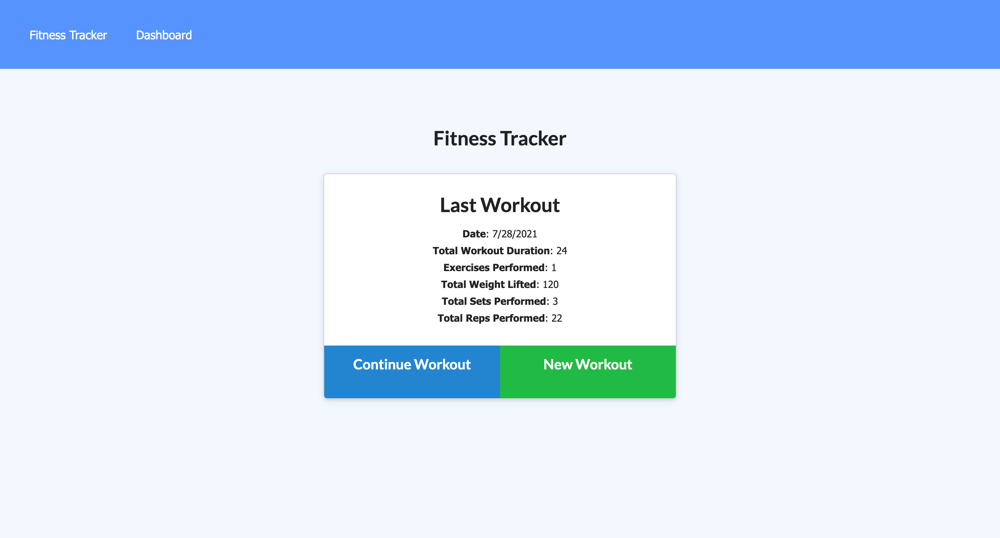
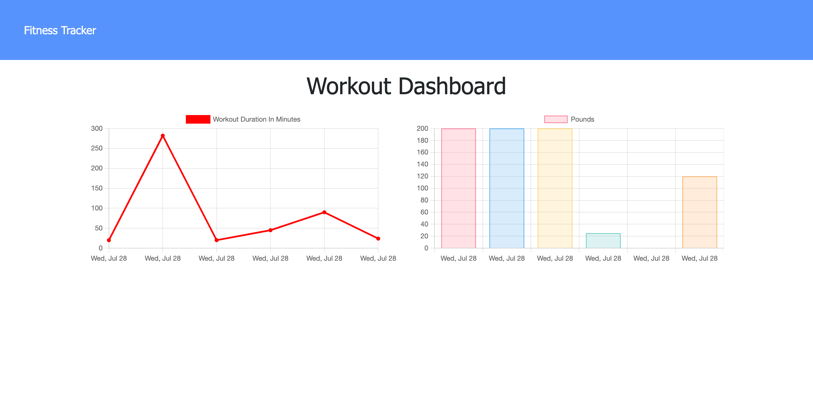

# Daily Fitness Tracker  

  <a href="https://opensource.org/licenses/MIT" alt="License">
        </a>
  
  ## Description
A workout tracker with a Mongo database, a Mongoose schema, and Express routes. There are 2 different types of exercise to choose from with seperate promts to fill in for each. If it is not your first time visiting, the previous workout information is displayed. Once a form for a new workout is filled in, there's an option to continue adding to your workout session or complete the workout. Navigating to your dashboard gives you a visualization of the time you spent working out and the resistance amount chosen for each workout session. 

  ## Table of Contents
  - [Installation](#installation)
  - [Usage](#usage)
  - [License](#license)
  - [Contributing](#Contributing)
  - [Tests](Test)
  - [Questions](Questions)

  ## Installation
  To install necessary dependencies, run the following command:
   ``` md
   npm i
   ```
  ## Usage
  A link to the deployed application can be found [here](https://cryptic-harbor-25063.herokuapp.com/).





  ## License
  This project is licensed under the [MIT](https://opensource.org/licenses/MIT) license.

  ## Contributing
  Please feel free to contact me! See my email and GitHub username below.

  ## Tests
  To run tests, run the following command:

  ``` md
  npm test
  ```
  ## Questions
  If you have any questions about the repo, open an issue or contact me directly at <sconwell.dev@gmail.com>. You can find more of my work at [shaneconwell](https://github.com/shaneconwell).

  